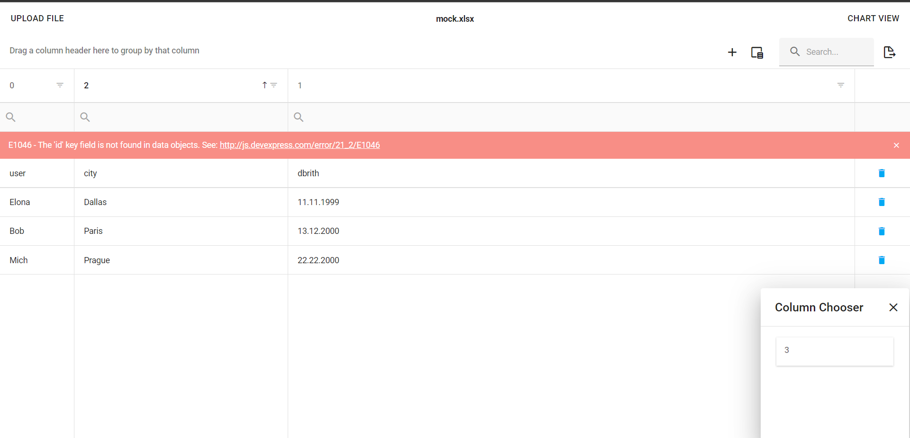
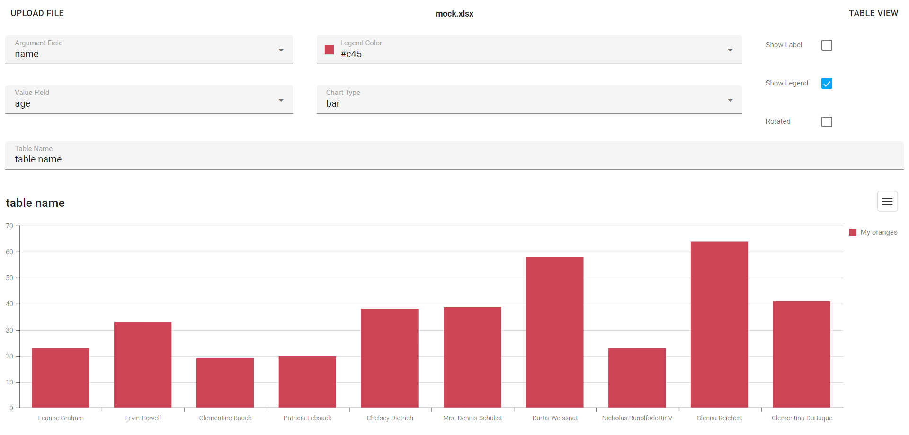

# report-constructor
Hackathon case winners project
```yarn -> yarn dev```

# How to use
You have some mocks in ```frontend/src/mocks```
Just upload them on first page and wait a bit

Then just use :)

